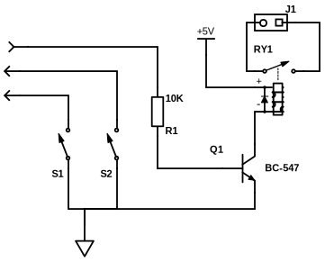

# Garage door controller

This is the software part of my garage door controller.

There are lots of projects like this outside. What I was missing was the presence
of dedicated *open* and *close* buttons. When I'm leaving my house, i wish to
press the *open* button and when I arrive outside at my garage, I want that the
door is open (and not closed, because it's already open when I pressed the button)

## Hardware

This application assumes, that the door engine is controlled via one button.
Furthermore, limit switches are necessary, to detect, if the door is in the
upper or lower position.

I use a Raspberry Pi with an relay to connect the door hardware. Other python
enabled computers are possible, too. Only the driver part should be created.

My external circuit looks like this:

## Software

The software creation is still in progress.

## Setup

sudo apt-get install python-pip
sudo pip install blinker
sudo pip install web.py
